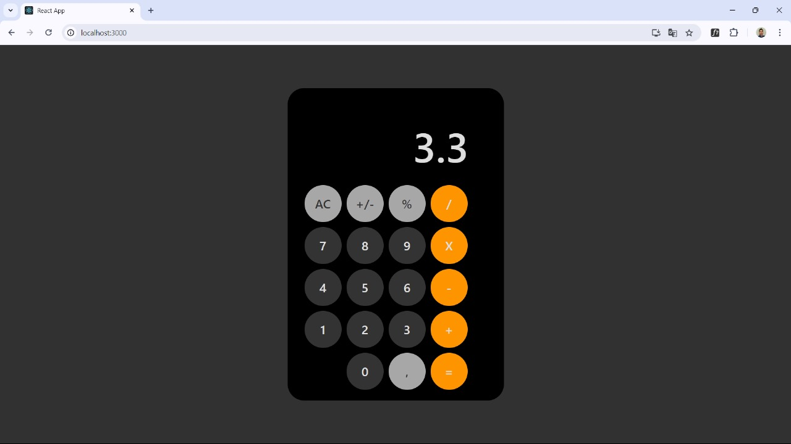

# Calculadora

Este é um projeto de uma calculadora simples desenvolvida com React e Bootstrap.




## Funcionalidades

- Adição, subtração, multiplicação e divisão
- Limpar resultado
- Conversão de sinal (positivo/negativo)
- Cálculo de porcentagem

## Tecnologias Utilizadas

- React
- Bootstrap
- CSS

### Funções

- `inputResult()`: Adiciona números ao resultado atual.
- `limpar()`: Limpa o resultado.
- `porcentagem()`: Calcula a porcentagem do resultado atual.
- `conversor()`: Converte o sinal do resultado atual.
- `operadorHandler()`: Armazena o operador e o resultado atual para operações futuras.
- `calculate()`: Realiza o cálculo com base no operador armazenado.

### Estilização

Estilização simples feita através do arquivo `Calculadora.css`. <a href="/teste/src/components/Calculadora.css">Saiba mais</a>

## Como Executar

1. Clone o repositório:
   ```bash
   git clone https://github.com/seu-usuario/calculadora.git
   ```
2. Navegue até o diretório do projeto:
   ```bash
   cd calculadora
   ```
3. Instale as dependências:
   ```bash
   npm install
   ```
4. Execute o projeto:
   ```bash
   npm start
   ```